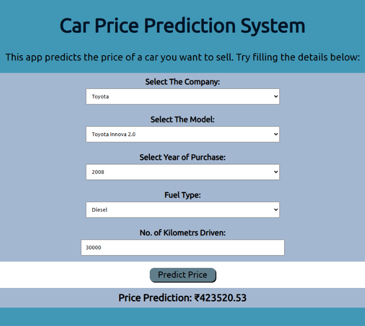
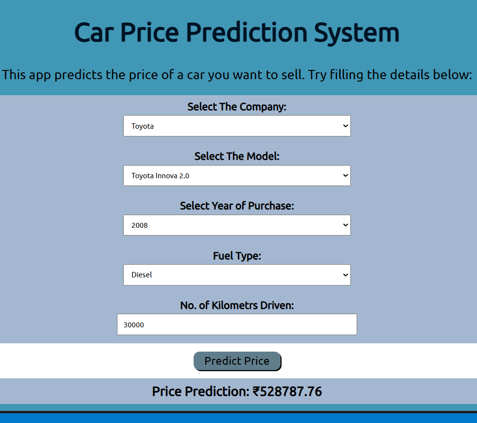

# 🚗 Car Price Prediction using Machine Learning

A Machine Learning web application that predicts the resale price of used cars using the Quikr Used Cars Dataset.

The project is built using Python, Scikit-Learn, and Flask and now includes an improved Random Forest Regressor model with hyperparameter tuning.

## Features

* Predict used car prices instantly
* User-friendly Flask web interface
* Supports:

  * Company
  * Model
  * Manufacturing Year
  * Fuel Type
  * Kilometers Driven
* Robust input validation
* Production-ready ML pipeline

---

## Tech Stack

* Python
* Pandas
* NumPy
* Scikit-Learn
* Flask
* HTML/CSS

---

## Dataset

Quikr Used Cars Dataset

Dataset contains:

* Company
* Model Name
* Manufacturing Year
* Fuel Type
* Kilometers Driven
* Selling Price

---

## Machine Learning Pipeline

### Data Preprocessing

* Missing value handling using SimpleImputer
* Target Encoding for high-cardinality categorical features
* One-Hot Encoding for fuel type
* Feature scaling using StandardScaler
* Automated preprocessing using ColumnTransformer

### Model Training

Two models were evaluated:

1. Linear Regression (Baseline)
2. Random Forest Regressor (Tuned)

Hyperparameter optimization performed using:

* RandomizedSearchCV
* 5-Fold Cross Validation

---

## Model Performance

| Metric   | Linear Regression | Random Forest (Tuned) |
| -------- | ----------------- | --------------------- |
| R² Score | 0.6424            | 0.6569                |
| MAE      | ₹114,031.91       | ₹119,475.34           |
| RMSE     | ₹269,839.88       | ₹264,327.75           |

### Observations

* Random Forest achieved a higher R² score.
* Random Forest reduced large prediction errors (RMSE).
* Better generalization on unseen data.

---

## Project Structure

```text
car prediction/
│
├── app.py
├── retrain_model.py
├── CarPriceModel.pkl
├── Cleaned Car.csv
├── templates/
│   └── index.html
├── static/
│   └── style/
│       └── style.css
└── README.md
```

## Running the Project

### Clone Repository

```bash
git clone <repository-url>
```

### Install Dependencies

```bash
pip install -r requirements.txt
```

### Retrain Model

```bash
python retrain_model.py
```

### Run Flask App

```bash
python app.py
```

Open:

http://127.0.0.1:5000

---

## Sample Prediction

Input:

* Company: Ford
* Model: EcoSport
* Year: 2019
* Fuel Type: Petrol
* Kilometers Driven: 25000

Output:

Predicted Car Price (INR)

---

## Future Improvements

* XGBoost Regressor
* LightGBM
* Car Age Feature
* Log-Transformed Target Variable
* Kilometers Driven Per Year
* Brand Tier Segmentation

---
## Application Screenshot

### LINEAR REGRESSION OUTPUT



### RANDOM FOREST OUTPUT


## Author

Mohammed Ghouse D

Machine Learning | Data Science | Python Developer
